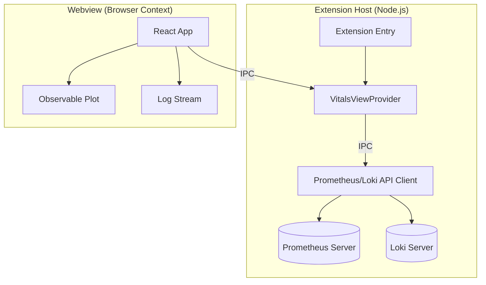

# Vitals: Bringing Enterprise Observability to Your Editor

Development loops are getting shorter, but the feedback loop for _performance_ often remains stuck in the slow lane. We switch context from our code to a browser, navigate to a Grafana dashboard, filter by service, find the right time range... and by then, we've lost our flow.

**Vitals** is an open-source VS Code extension designed to bridge this gap. It brings real-time metrics, logs, and alerts directly into your development environment, transforming VS Code into a first-class observability hub.

In this post, we'll traverse the technical architecture of Vitals, exploring how we built a performant, premium observability experience using **Prometheus**, **VS Code's Extension API**, and **React**.

## The Problem: Context Switching Costs

Every time you `Alt+Tab` away from your code to check a metric, you incur a cognitive cost. For microservices developers, this constant context switching between the IDE and observability tools (Prometheus, Grafana, Kibana) fragments focus.

Vitals solves this by embedding the "Three Pillars of Observability" **Metrics, Logs, and Traces (Alerts)** directly where the code lives.

## Architecture: A Bridge Between Worlds

Vitals operates on a split architecture, leveraging VS Code's extension capabilities to handle heavy lifting and a webview to render a rich UI.



### 1. The Extension Host (The Backend)

The "backend" of our extension runs in the VS Code Extension Host process. This is a Node.js environment where we handle:

- **Configuration Management**: Reading user settings for Prometheus URLs and refresh intervals.
- **Data Fetching**: We built a custom `PrometheusApi` class to interface with Prometheus's HTTP API. It handles PromQL queries, range calculations, and error handling.
- **IPC Messaging**: The `VitalsViewProvider` class acts as the controller. It listens for messages from the frontend (like `fetchMetrics` or `createSilence`) and routes them to the appropriate API handlers.

### 2. The Webview (The Frontend)

To achieve a "premium" look and feel that goes beyond standard VS Code UI widgets, we utilize the **Webview API**. This allows us to render a full React application within a sandboxed `<iframe>`.

- **React & Hooks**: We use custom hooks like `useVitalsData` to manage the polling lifecycle and state for metrics and logs.
- **Visualization**: For rendering performant, beautiful charts, we chose **@observablehq/plot**. It's declarative, lightweight, and produces SVG output that scales perfectly with VS Code's responsive windows.

## Technical Deep Dive

### Real-time Metric Streaming

One of the biggest challenges was ensuring the UI felt **_live_** without overwhelming the Prometheus server or the VS Code editor.

We implemented an efficient polling mechanism in `vitalsView.ts`. When the frontend requests `fetchMetrics`, the extension host calculates the time range dynamically:

```typescript
// From src/vitalsView.ts
const end = Math.floor(Date.now() / 1000);
const start = end - 30 * 60; // Last 30 minutes window
const step = 15; // 15-second resolution

const data = await api.queryRange(message.query, start, end, step);
```

This data is then serialized and sent via the IPC bridge `webview.postMessage(...)` to the React app, which updates the `MetricChart` component.

### Building a Premium UI System

We didn't want Vitals to look like a "hacked together" web page. It needed to feel native yet premium. We achieved this through a strict design system defined in `App.css`, utilizing VS Code's native theme variables to support light, dark, and high-contrast themes automatically.

**Glassmorphism & Micro-interactions:**
We used semi-transparent backgrounds and subtle borders to create depth:

```css
/* From webview/src/App.css */
.card {
  background-color: var(--vscode-editor-background);
  border: 1px solid var(--vscode-widget-border);
  box-shadow: 0 4px 6px -1px rgba(0, 0, 0, 0.1);
  transition: transform 0.2s ease;
}

.card:hover {
  transform: translateY(-2px);
  border-color: var(--primary); /* Electric Blue */
}
```

This attention to detail - hover states, smooth transitions, and distinct color palettes for alerts (Critical Red vs. Warning Yellow) ensures the tool is not just functional, but a joy to use.

### Integrated Alert Management

Vitals isn't just for looking at graphs; it's for taking action. We integrated with **Alertmanager** to allow developers to view and silence alerts directly from the editor.

This required implementing a form overlay in React that gathers silence parameters (author, comment, duration) and helps the user POST a structured payload to the Alertmanager API via the extension host.

## Try It Out

Vitals is open source and available for installation.

Join us in building the future of developer-first observability. Monitoring shouldn't be an afterthought, it should be a **vital** part of your workflow.

## Go-to

| [Repo ↗](https://github.com/theaniketraj/vitals) | [Portal ↗](https://theaniketraj.github.io/vitals) | [Marketplace ↗](https://marketplace.visualstudio.com/items?itemName=theaniketraj.vitals) | [Open VSX ↗](https://open-vsx.org/extension/theaniketraj/vitals) |
| ------------------------------------------------- | -------------------------------------------------- | ----------------------------------------------------------------------------------------- | ----------------------------------------------------------------- |
